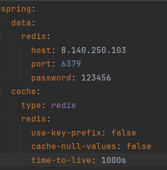
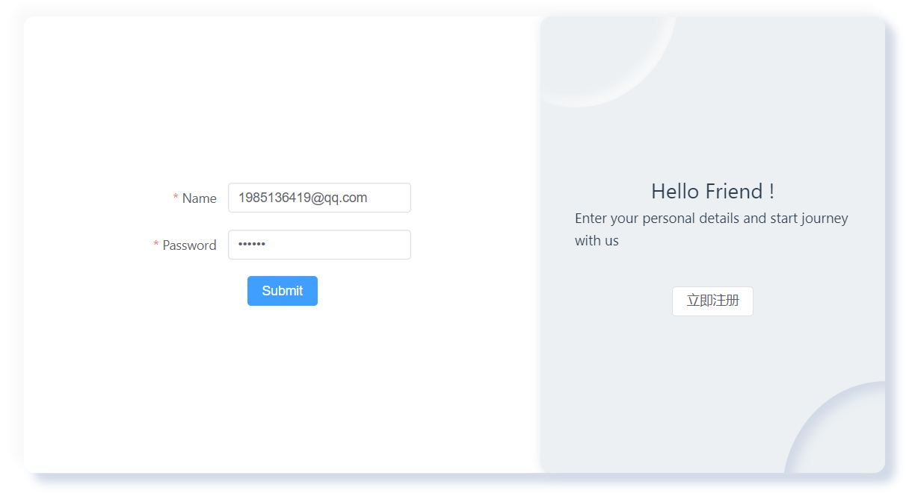

# assignment1-javaEE

## API Design

[ApiDesignAndTestDoc.md](./ApiDesignAndTestDoc.md)

## Implementation and Display

### Spring MVC and boot

**Environment:**

- jdk - 17

- spring boot - 3.2.5

**Implements and Results：**

​	 

​	 

### Data Repository

**Environment：**

- MyBatis - 3.0.3
- MySQL - 8

**Database Design：**

**Implements：**

​	We use mybatis to connect to database by mapper annotation.

​	 

### Testing

**Environment：**

- boot testing framework
- mockMVC

**Implements：**

​	We use MockMVC to simulate user HTTP request operations to complete testing

​	 

**Results：**

​	All test cases passed

​	 

​	In addition, we also use APIfox to test APIs.

​	    

​	**Complete test report：** [AutoWareManageTestDoc.md](https://github.com/SHIDi233/Automated-Ware-API-Homework/blob/master/ApiDesignAndTestDoc.md)

### Authentication and Session Control

**Environment：**

- spring security - 6.2.4
- jjwt - 0.11.2
- redis - 6.0.16

**Implements：**

1. Defined a `SecurityFilterChain` bean to configure HttpSecurity.
   

2. Implement `UserDetailsService` and `UserDetails` to define customized authentication process

3. Define a filter `JwtAuthenticationTokenFilter` before `WebAsyncManagerIntegrationFilter`. When the user login in, the jwt will be storaged in the redis cache. When the user request for other api with jwt, this filter will check the jwt and read user's information from redis cache.
    

4. When the user login, `UserDetailsService` will give him a `GrantedAuthority` class as role. Then we use annotation `@PreAuthorize("hasRole('admin')")` to specify the roles allowed by the interface.

    

### Caching

**Environment：**

- redis - 6.0.16

**Implement：**

The main components of Spring Cache include:

1. `@Cacheable`：triggers caching, you can specify the key and the name of the cache.
2. `@CachePut`：puts the return value directly into the cache without affecting method execution.
3. `@CacheEvict`：remove the cache.

- We use Redis as cache carrier. Set up redis configuration such as IP, port, password, expiration time, etc.

​		

- Extend `CachingConfigurerSupport` to config cache.

​		

- Finally, we use annotation `Cacheable` to implement.

​		

**Results：**

​	Twice requests time comparison：

​	**request all the warehouses：**

-  

​		216ms

-  

​		90ms	

​	**request for all cargoes：**

-  

​		242ms

-  

​		127ms

​	A significant speed increase can be observed, proving that the caching mechanism is in effect.

### Rate Limiting

**Environment：**

- google.guava - 20.0

**Profile：**

​	The Token Bucket is a method used for rate limiting, where the bucket holds a certain number of tokens. Tokens are added to the bucket at a predetermined rate. When the bucket is full, any additional tokens overflow and are discarded, preventing the bucket from exceeding its capacity.  

​	The evaluation of traffic compliance is based on whether the number of tokens in the bucket is sufficient to forward the packets. Each packet that needs to be forwarded must obtain a certain number of tokens from the bucket (the specific number depends on the size of the packet) to be forwarded normally. 

​	If there are enough tokens in the bucket to forward the packet, the traffic is said to be compliant or within the agreed value. If there are not enough tokens, the traffic is considered non-compliant or exceeding the limit.

**Implements：**

- implement `@Limiting`

​	 

​	 

**Results：**

​	When we request frequently, the server will return:

​	 

### Log

**Implements：**

​	We use annotation `@Slf4j` and `log.info()` to output log.

​	 

**Display：**

​	 

# Screenshots

## 登录注册

### 注册

输入邮箱、密码、名字即可完成注册。

	

### 登录

输入邮箱与密码实现用户登录。

登录后右上角显示登录成功并跳转到首页。

## 仓库库区操作

### 仓库

#### 添加仓库

点击添加仓库，输入要添加的仓库名称，即可添加。

点击创建仓库后，右上角显示创建成功，并且可在仓库列表中查看添加后的仓库ID与名称。

#### 删除仓库

点击表格中的仓库进行删除，成功后右上角会显示删除成功字样。

#### 仓库列表查看

在本页面可以看到用户所拥有的所有仓库ID与名称。

### 库存操作

#### 入库

输入对应仓库想入库的货物ID与入库的货物数目，再点击入库按钮即可实现货物入库。

入库成功后右上角会显示入库成功字样，并且在该页面可以看到刚刚入库的20个通讯工具。

#### 出库

输入仓库内已有的想出库的货物ID和对应出库数目，点击出库按钮即可实现货物出库。

出库成功后右上角显示出库成功字样，可以在库存表中看到通讯工具库存变为10，成功出库了10个商品。

#### 库存查看

在该页面可以查看仓库中所有库存名称、简介与库存数。

### 仓库人员

#### 角色添加

输入想要添加人物的邮箱和想让其担任的角色，点击添加即可实现角色的添加。

添加后可看到右上角的添加成功字样并在角色列表中看到刚刚添加的人物名称和角色(TestUser) 。

#### 角色查看

在该页面可以看到所有当前仓库内的人物名称和角色。

## 物料管理操作

### 分类

我们对物料，即货物的种类做全局规定。

#### 节点添加

##### 根节点添加

对货物种类增加根节点，输入根节点名称及描述，点击创建。

创建后即可在树表中看到通讯工具根节点已被加入。

##### 子节点添加

点击根节点加号，输入子节点名称及描述，点击创建。

创建后可在树表中看大通讯工具下手机子类已被创建。

##### 节点列表查看

当前页面可以查看所有种类（以树形结构展示）。

##### 节点修改

点击节点中的修改，填入修改后的节点名称与描述，点击提交。

修改后可在页面中看到节点名称已经更改。

